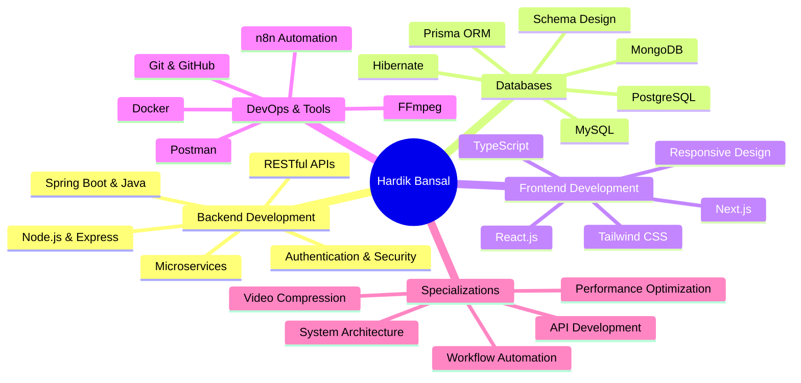

<!-- 
██╗  ██╗ █████╗ ██████╗ ██████╗ ██╗██╗  ██╗    ██████╗  █████╗ ███╗   ██╗███████╗ █████╗ ██╗     
██║  ██║██╔══██╗██╔══██╗██╔══██╗██║██║ ██╔╝    ██╔══██╗██╔══██╗████╗  ██║██╔════╝██╔══██╗██║     
███████║███████║██████╔╝██║  ██║██║█████╔╝     ██████╔╝███████║██╔██╗ ██║███████╗███████║██║     
██╔══██║██╔══██║██╔══██╗██║  ██║██║██╔═██╗     ██╔══██╗██╔══██║██║╚██╗██║╚════██║██╔══██║██║     
██║  ██║██║  ██║██║  ██║██████╔╝██║██║  ██╗    ██████╔╝██║  ██║██║ ╚████║███████║██║  ██║███████╗
╚═╝  ╚═╝╚═╝  ╚═╝╚═╝  ╚═╝╚═════╝ ╚═╝╚═╝  ╚═╝    ╚═════╝ ╚═╝  ╚═╝╚═╝  ╚═══╝╚══════╝╚═╝  ╚═╝╚══════╝
-->

<div align="center">

</div>

<div align="center">

</div>

<br/>

```bash
┌─[hardik@terminal]─[~/achievements]
└──╼ $ whoami
Hardik Bansal • Backend Developer • Full-Stack Engineer • System Optimizer

┌─[hardik@terminal]─[~/stats]
└──╼ $ ls -la
drwxr-xr-x  2+ years of hands-on development experience
drwxr-xr-x  10+ production-ready projects delivered
-rw-r--r--  65% file size reduction achieved (video compression)
-rw-r--r--  40% performance improvement (website optimization)
-rw-r--r--  200+ participants managed (coding contests & assessments)
-rw-r--r--  400+ technical questions curated (GFG assessments)
-rw-r--r--  15+ technologies mastered across full-stack ecosystem

┌─[hardik@terminal]─[~/current_focus]
└──╼ $ cat mission.txt
Building scalable backend systems with Node.js & Java
Architecting efficient microservices and RESTful APIs
Optimizing system performance through intelligent caching & compression
Learning through real-world projects and collaborative development
```

<br/>

<table align="center">
<tr>
<td></td>
<td></td>
<td></td>
</tr>
</table>

<div align="center">
<a href="https://github.com/hardikbansal31"></a>
<a href="mailto:bansalhardik31@gmail.com"></a>

</div>

<br/>

---

## 🚀 Professional Identity

<table width="100%">
<tr>
<td width="50%" valign="top">

```typescript
class HardikBansal implements BackendEngineer {
  private readonly identity = {
    name: "Hardik Bansal",
    location: "Mumbai, India",
    role: "Backend Developer & Full-Stack Engineer",
    education: "B.E. Computer Engineering (CGPA: 9.38)",
    institution: "TCET Mumbai"
  };

  private expertise: TechStack = {
    backend: ["Node.js", "Express.js", "Spring Boot"],
    languages: ["Java", "JavaScript", "TypeScript", "Python"],
    frontend: ["React.js", "Next.js", "HTML5", "CSS3"],
    styling: ["Tailwind CSS", "Bootstrap"],
    databases: ["MySQL", "MongoDB", "PostgreSQL"],
    orm: ["Prisma", "Hibernate"],
    devops: ["Docker", "Git", "GitHub"],
    tools: ["Postman", "FFmpeg", "n8n"],
    specialization: [
      "RESTful API Development",
      "Microservices Architecture",
      "Video Compression Systems",
      "Database Schema Design",
      "Performance Optimization",
      "Workflow Automation"
    ]
  };

  getCurrentFocus(): string[] {
    return [
      "Building scalable backend systems",
      "Optimizing system performance",
      "Learning AI/ML integration",
      "Mastering microservices patterns",
      "Contributing to open-source"
    ];
  }
}
```

</td>
<td width="50%" valign="top">

```python
class AchievementMatrix:
    def __init__(self):
        self.metrics = {
            'education': {
                'cgpa': 9.38,
                'degree': 'B.E. Computer Engineering',
                'institution': 'TCET Mumbai',
                'graduation_year': 2027
            },
            'experience': {
                'years_coding': '2+',
                'projects_delivered': 10,
                'organizations_contributed': 3,
                'participants_managed': 200,
                'questions_curated': 400
            },
            'impact_metrics': {
                'video_compression_reduction': '65%',
                'website_performance_boost': '40%',
                'api_endpoints_built': '25+',
                'database_schemas_designed': '8+',
                'docker_containers_deployed': '5+'
            },
            'technical_reach': {
                'github_repos': 22,
                'languages_mastered': 7,
                'frameworks_used': 10,
                'tools_proficient': 15
            }
        }
    
    def get_specialization(self):
        return [
            "Backend Systems Architecture",
            "RESTful API Development",
            "Video Processing & Compression",
            "Database Design & Optimization",
            "Full-Stack Web Development",
            "Workflow Automation"
        ]
    
    def get_current_role(self):
        return {
            'position': 'AI & Full Stack Developer Intern',
            'company': 'F1Jobs.io',
            'status': 'Active',
            'focus': 'Workflow automation & client solutions'
        }
```

</td>
</tr>
</table>

<br/>

---

## 📊 Development Metrics Dashboard

<div align="center">

<table>
<tr>
<td align="center" width="25%">

<br/><b>Academic Excellence</b>
</td>
<td align="center" width="25%">

<br/><b>Hands-On Development</b>
</td>
<td align="center" width="25%">

<br/><b>Production Systems</b>
</td>
<td align="center" width="25%">

<br/><b>Performance Impact</b>
</td>
</tr>
<tr>
<td align="center" width="25%">

<br/><b>Event Management</b>
</td>
<td align="center" width="25%">

<br/><b>Technical Content</b>
</td>
<td align="center" width="25%">

<br/><b>Technology Mastery</b>
</td>
<td align="center" width="25%">

<br/><b>Backend Systems</b>
</td>
</tr>
</table>

</div>

<br/>

---

## 💡 About Me

I'm **Hardik Bansal**, a passionate **Backend Developer** and **Full-Stack Engineer** currently pursuing B.E. in Computer Engineering at Thakur College of Engineering & Technology (TCET), Mumbai, with an outstanding **9.38 CGPA**. My journey in software development is driven by a deep fascination with building **scalable, efficient systems** that solve real-world problems.

With over **2 years of hands-on development experience**, I've successfully delivered **10+ production-ready projects** spanning backend systems, full-stack web applications, video processing platforms, and workflow automation solutions. My technical expertise centers around **Node.js, Java, Spring Boot**, and modern JavaScript frameworks, with a proven track record of optimizing system performance and architecting robust APIs.

**What sets me apart:**

🎯 **Performance Optimization Expert**: Achieved a remarkable **65% file size reduction** in video compression systems using FFmpeg with VP9+Opus codecs, while implementing adaptive streaming with multi-resolution support (720p, 480p, 360p). Improved website load speeds by **40%** through strategic React.js optimization and efficient architecture.

🔧 **Backend Systems Architect**: Designed and developed **25+ RESTful API endpoints** with secure authentication, Range request support, and comprehensive error handling. Built scalable microservices using Node.js, Express, and Spring Boot, integrated with MySQL, MongoDB, and PostgreSQL databases using Prisma and Hibernate ORMs.

🚀 **Full-Stack Versatility**: Proficient in the complete development lifecycle from database schema design to frontend UI/UX implementation. Built responsive, production-grade applications using React.js, Next.js, Tailwind CSS, and modern JavaScript (ES6+), with Docker containerization for seamless deployment.

💼 **Currently Contributing**: As an **AI & Full Stack Developer Intern at F1Jobs.io** (December 2025 - Present), I'm building workflow automations using n8n to streamline client operations, developing responsive portfolio websites, and collaborating with distributed teams across time zones to deliver production-ready features.

📚 **Community Leadership**: Served as **Technical Team Member at GeeksForGeeks Student Chapter (GFG TCET)**, where I built and managed technical systems for webinars, coding contests, and assessments, creating **400+ technical questions** and managing events with **200+ participants**. At **S.O.R.T Club of TCET**, I rebuilt the club website using React.js, achieving a **40% load speed improvement**.

🎓 **Continuous Learner**: Beyond formal education, I'm constantly exploring emerging technologies, contributing to open-source projects, and building practical applications to sharpen my skills. My GitHub portfolio showcases diverse projects from video compression platforms to smart city applications, demonstrating my ability to tackle complex technical challenges.

**My Development Philosophy**: I believe in writing clean, maintainable code that prioritizes performance, scalability, and user experience. Every project is an opportunity to learn, optimize, and deliver tangible value. Whether it's reducing file sizes by 65%, improving load times by 40%, or building systems that serve hundreds of users, I focus on measurable impact and technical excellence.

I'm actively seeking opportunities to contribute to innovative projects, collaborate with talented teams, and continue growing as a software engineer. Let's build something amazing together!

<br/>

---

## 🎯 Technical Expertise Visualization



<br/>

---

## 📈 Professional Journey Timeline

```mermaid
timeline
    title Career & Development Journey
    2023 : Started B.E. Computer Engineering at TCET
         : Built foundational skills in Java and JavaScript
         : Achieved 9.38 CGPA in first year
    2024 : Joined S.O.R.T Club Technical Team
         : Rebuilt club website with React.js
         : Improved website load speed by 40 percent
         : Developed Smart City Website with MERN stack
    2025 : Joined GeeksForGeeks Student Chapter
         : Built technical systems for 200+ participants
         :